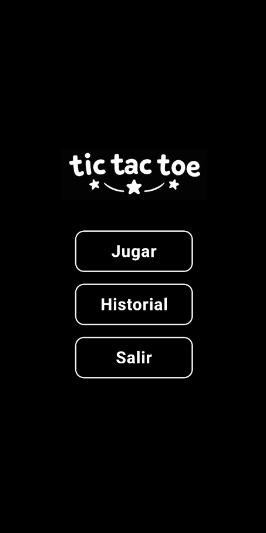
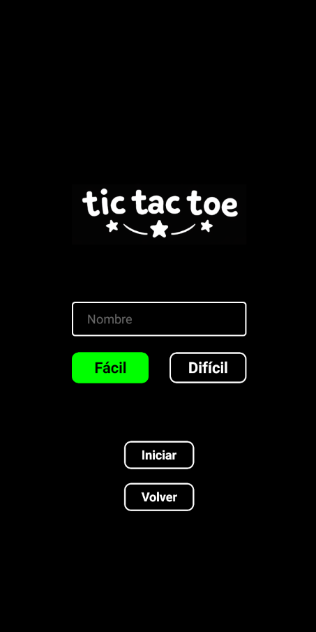
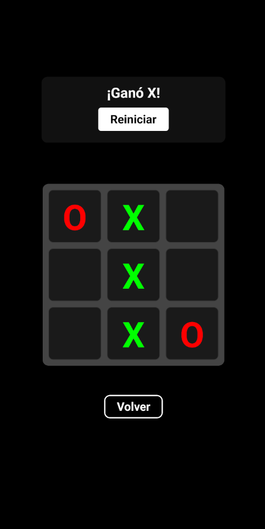
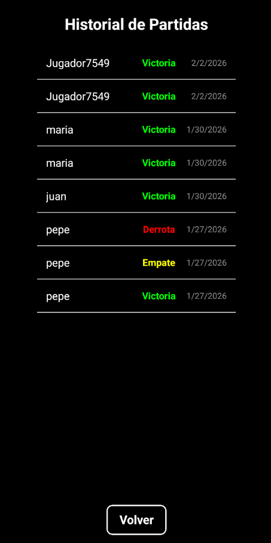

# Tres en Raya

Aplicación web para jugar al clásico Tres en Raya, desarrollada con React native con TypeScript.

## Capturas de pantalla

### Pantalla de inicio
La pantalla principal donde el usuario puede comenzar una nueva partida o acceder al historial.



### Menú principal
Desde aquí se navega a las diferentes secciones de la app.



### Juego en curso
Vista de la partida de Tres en Raya en desarrollo.



### Historial de partidas
Muestra el registro de partidas jugadas y sus resultados.



## Tecnologías utilizadas
- **Frontend:** React Native (TypeScript)
- **Backend:** Node.js con Express
- **Base de datos:** PostgreSQL

## Estructura del proyecto
- `/src/screens/` — Pantallas de la app (Inicio, Juego, Menú, Historial)
- `/api/` — Servidor, rutas y modelos de datos
- `/assets/` — Recursos estáticos
- `/info/` — Documentación técnica

## Instalación y uso
1. Instala las dependencias:
   ```bash
   npm install
   ```
2. Inicia el servidor de desarrollo:
   ```bash
   ./start-dev.sh #Linux y Mac
   ./start-dev-win.bat #Windows
   ```
3. Accede a la app desde tu entorno local.


## Autor
Santi Martínez
